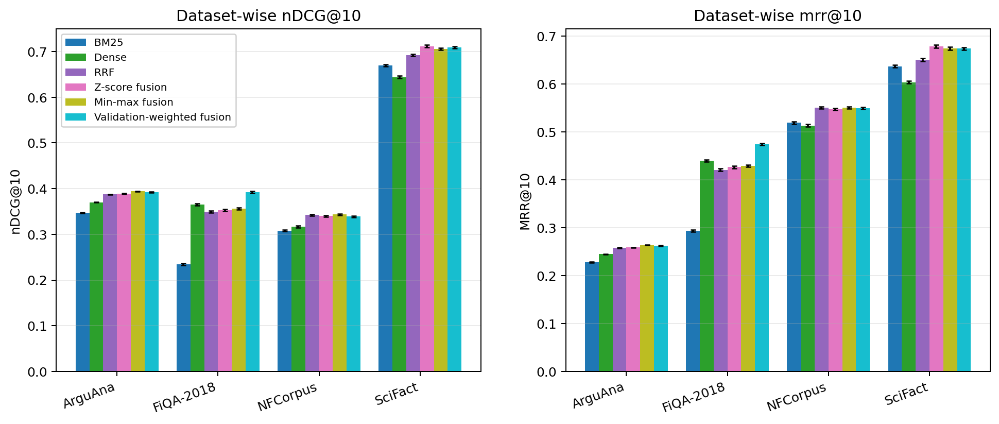
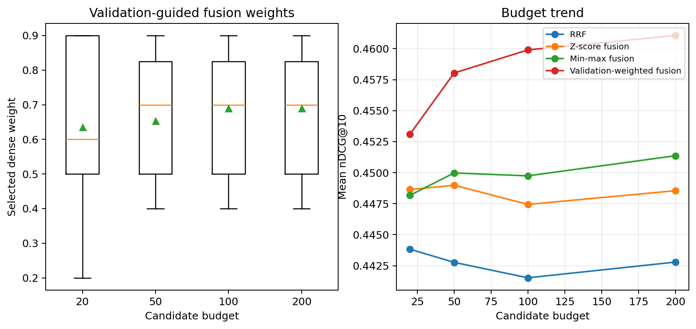
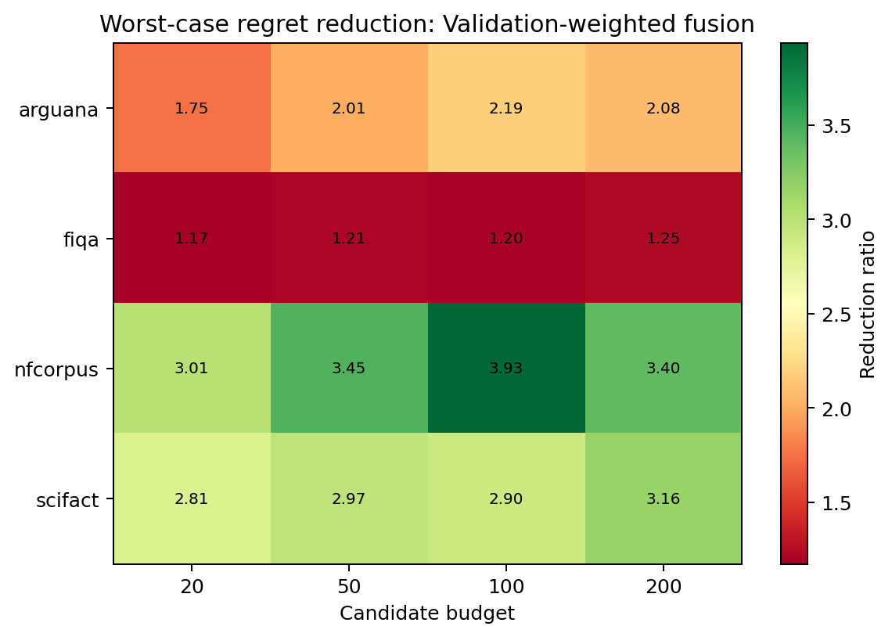
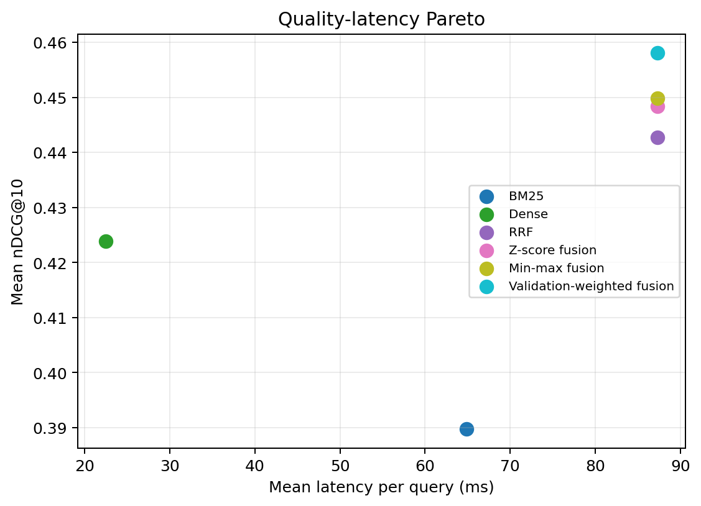

# Validation-Guided Sparse-Dense Score Fusion for Lightweight Neural Retrieval

> **Validation-Guided Sparse-Dense Score Fusion for Lightweight Neural Retrieval**
>
> Yaowen Sun, Shaolei Zhao, Hai Fu

## Overview

This repository contains a sanitized reproducibility bundle for a controlled
retrieval-fusion study. The study asks whether a small validation split can
guide score fusion between BM25 and a compact dense retriever well enough to
reduce the risk of choosing the weaker single retriever in advance.

The released evidence covers 672 formal evaluation cells: 4 public retrieval
datasets, 4 per-retriever top-K candidate budgets, 6 retrieval or fusion
methods, and 7 random seeds. The paired statistical analysis uses 112
dataset-budget-seed units and compares fusion methods against BM25, dense
retrieval, the average single retriever, the best single retriever, and the
strongest static score-normalized baseline.

## Repository Structure

```text
.
├── README.md                                  # Project overview and reproducibility notes
├── LICENSE                                    # MIT license
├── requirements.txt                           # Minimal Python package list
├── src/
│   ├── fusion_pipeline.py                     # Sparse retrieval, dense retrieval, and fusion utilities
│   ├── run_pilot.py                           # Bounded pilot runner
│   ├── run_formal.py                          # Formal matrix runner
│   ├── run_phase4_analysis.py                 # Aggregation, statistics, tables, and figures
│   └── summarize_public_results.py            # Public data validator and summary script
├── tests/
│   ├── test_fusion_pipeline.py                # Unit tests for core fusion utilities
│   └── test_public_results.py                 # Data-level locked-claim test
├── data/
│   ├── formal_records.csv                     # 672 formal evaluation rows
│   ├── formal_summary.json                    # Formal execution summary
│   ├── formal_quality_report.json             # Formal quality gate summary
│   ├── formal_gate.json                       # Regret-reduction gate details
│   ├── phase4_analysis_report.json            # Phase 4 statistical report
│   ├── aggregates/                            # Method-level aggregate CSV files
│   └── statistics/                            # Planned/static contrasts and Friedman tests
└── figures/
    ├── dataset_wise_ranking_quality.png       # Dataset-wise ranking quality
    ├── fusion_weight_and_budget_behavior.png  # Validation-weight and budget behavior
    ├── worst_case_regret_reduction_heatmap.png # Regret-reduction heatmap
    └── quality_latency_pareto.png             # Quality-latency Pareto view
```

## Experimental Setup

| Dimension | Values |
|---|---|
| Sparse retriever | BM25 |
| Dense retriever | `sentence-transformers/all-MiniLM-L6-v2` |
| Datasets | SciFact, NFCorpus, FiQA-2018, ArguAna |
| Candidate budgets | 20, 50, 100, 200 |
| Seeds | 19, 31, 47, 73, 109, 149, 181 |
| Methods | BM25; dense; RRF; z-score fusion; min-max fusion; validation-weighted fusion |
| Formal result rows | 672 rows = 4 datasets x 4 budgets x 6 methods x 7 seeds |
| Paired units | 112 units = 4 datasets x 4 budgets x 7 seeds |

Dataset sizes in the formal run:

| Dataset | Corpus docs | Queries | Used qrels-backed queries |
|---|---:|---:|---:|
| SciFact | 5,183 | 1,109 | 300 |
| NFCorpus | 3,633 | 3,237 | 323 |
| FiQA-2018 | 57,638 | 6,648 | 648 |
| ArguAna | 8,674 | 1,406 | 1,401 |

## Hardware & Environment

| Component | Specification |
|---|---|
| CPU | Intel Core i9-12900K (16C/24T) |
| RAM | 128 GB DDR5 |
| GPU | NVIDIA RTX PRO 6000 Blackwell (96 GB VRAM) |
| OS | Ubuntu 22.04 (WSL2) |

### Software Versions

| Package | Version |
|---|---|
| Python | 3.11.15 |
| PyTorch | 2.11.0+cu128 |
| CUDA | 12.8 |
| Transformers | 5.4.0 |
| PEFT | not used |
| Datasets | public BEIR-format retrieval datasets |
| scikit-learn | 1.8.0 |
| NumPy | 2.4.4 |
| pandas | 3.0.1 |
| SciPy | 1.17.1 |

## Key Results

- The formal matrix completed 672 out of 672 cells with zero recorded failures.
- All four fusion methods reduced average single-retriever selection regret in
  112 out of 112 dataset-budget-seed cells.
- Validation-weighted fusion improved over the average single-retriever
  comparator by +0.0512 nDCG@10, with 95% bootstrap CI [0.0463, 0.0562] and
  Holm-adjusted p = 6.55e-19.
- Validation-weighted fusion improved over the average single-retriever
  comparator by +0.0551 MRR@10, with 95% bootstrap CI [0.0493, 0.0611] and
  Holm-adjusted p = 6.55e-19.
- Validation-weighted fusion also improved over min-max fusion by +0.0082
  nDCG@10, with 95% bootstrap CI [0.0053, 0.0113] and Holm-adjusted p = 0.0049.
- Validation-weighted fusion improved over min-max fusion by +0.0106 MRR@10,
  with 95% bootstrap CI [0.0071, 0.0144] and Holm-adjusted p = 0.0024.
- Positive dataset support for the selected nDCG@10 delta exceeded the
  prespecified threshold on 4 out of 4 datasets.

These results are bounded to the tested datasets, budgets, seeds, retrievers,
and fusion rules. They support a controlled validation-guided fusion result, not
a new retriever architecture or training algorithm. The static-baseline margin
is modest and should be interpreted as a bounded top-rank quality improvement,
not as a general dominance claim.

## Requirements

The public data validator uses only the Python standard library. Running the
aggregation and figure scripts uses the packages below:

```bash
pip install -r requirements.txt
```

Quick checks:

```bash
python3 src/summarize_public_results.py --data-dir data
PYTHONPATH=src python3 -m unittest discover -s tests -v
```

Full retrieval execution additionally requires local dataset/model caches or
network access to the public retrieval datasets and model files. This bundle is
intended for archived summary reproduction and data-level checking.

## Data Format

`data/formal_records.csv` contains one row per dataset, budget, method, and
seed. The core columns are:

| Column | Meaning |
|---|---|
| `dataset` | Public retrieval dataset name |
| `budget` | Per-query top-K candidate depth retained from each retriever before fusion and evaluation |
| `method` | Retrieval or fusion method |
| `seed` | Validation/test split seed |
| `ndcg@10`, `mrr@10`, `recall@100` | Held-out test metrics |
| `latency_query_ms` | Formal-runner latency per query in milliseconds |
| `dense_weight` | Validation-selected dense weight, when applicable |

## Figures









## Citation

```bibtex
@article{sun2026validation_guided_sparse_dense_fusion,
  title = {Validation-Guided Sparse-Dense Score Fusion for Lightweight Neural Retrieval},
  author = {Sun, Yaowen and Zhao, Shaolei and Fu, Hai},
  year = {2026}
}
```

## License

This repository is released under the MIT License.
